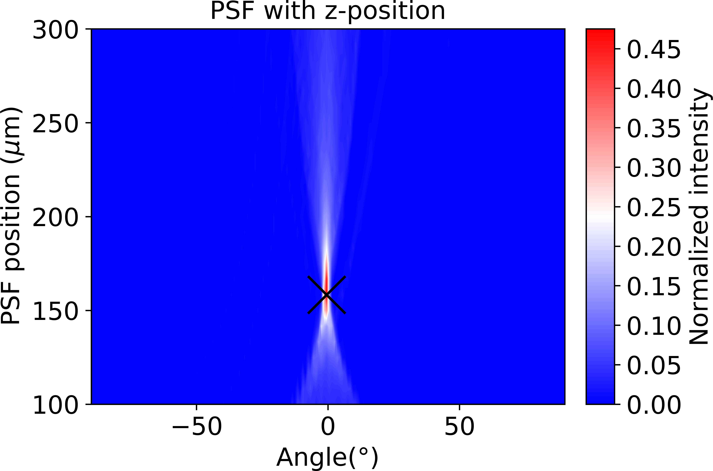

# Experimental_profile_ray_tracing

In this project we use ray tracing to simulate the point spread function and other optical metrics for a confocal measured experimental lens profile.

The rays are propagating from the top to a microlens array printed in the polycarbonate.


# to install the ray_tracing lib package

```shell
pip install -e .
```